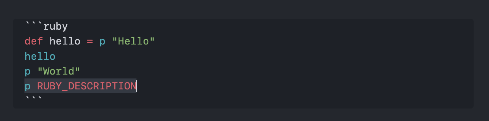
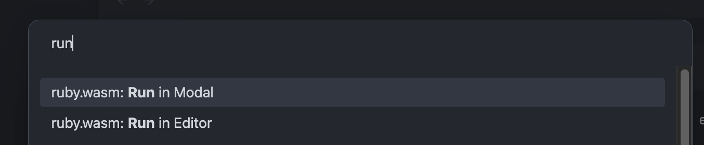
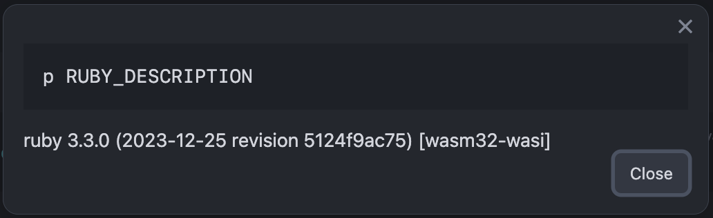

# Obsidian RubyWasm Plugin

This is a ruby.wasm plugin for Obsidian (https://obsidian.md).

# How to use

Select a code block

Execute command

Get Results

## API Documentation

See https://github.com/obsidianmd/obsidian-api
