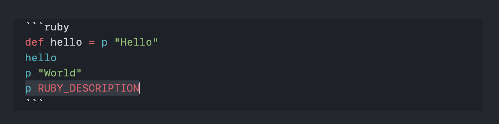
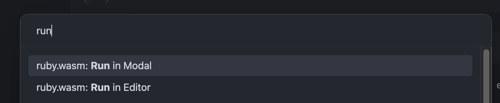
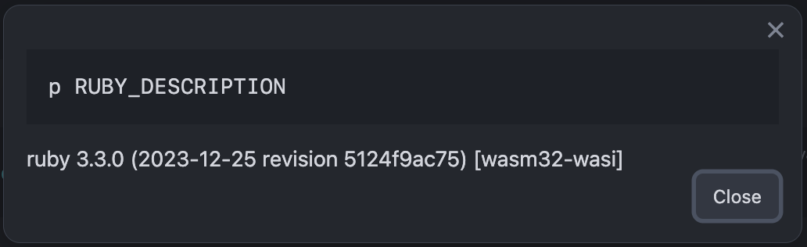

# Obsidian RubyWasm Plugin

This is a ruby.wasm plugin for Obsidian (https://obsidian.md).

The plugin downloads the selected Ruby WebAssembly runtime from jsDelivr the first time you run a command so the shipped `main.js` stays small enough for Obsidian Sync.

## Ruby versions

You can choose the runtime version in **Settings -> Community plugins -> ruby.wasm**.

Currently supported:

- Ruby HEAD
- Ruby 4.0
- Ruby 3.4
- Ruby 3.3
- Ruby 3.2

# How to use

Select a code block

Execute command

Get Results

## API Documentation

See https://github.com/obsidianmd/obsidian-api
